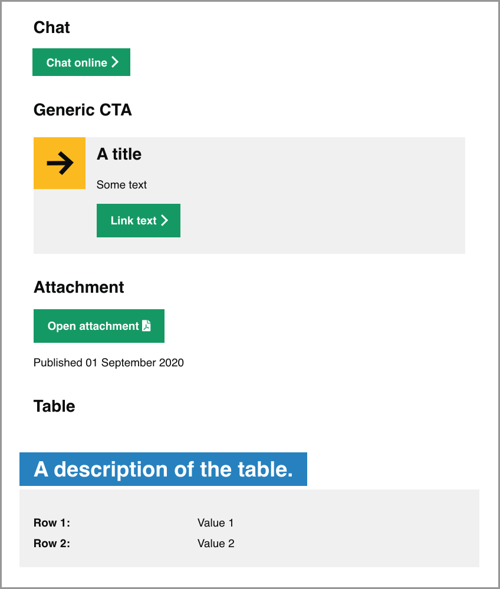
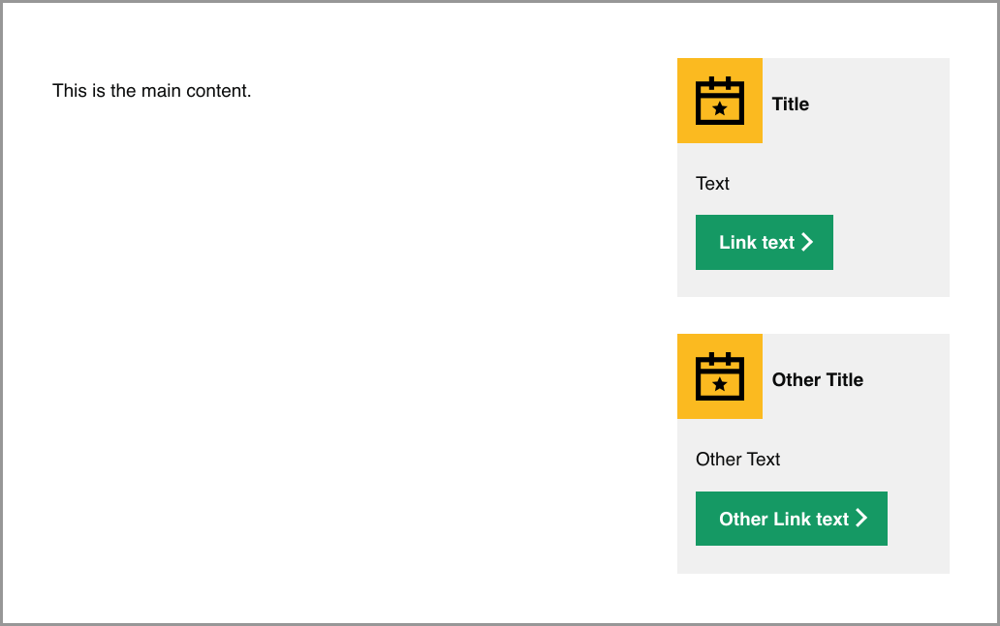

# Content Documentation/Guide

This documentation aims to be a reference for content editors that want to make changes to the Get into Teaching website. It contains details of how the content is structured, tips on editing content and specific guides on creating certain types of content.

## Table of Contents

1. [Finding a Page/Content to Edit](#finding-a-pagecontent-to-edit)
2. [Content Editing Tips/Info](#content-editing-tips-info)
	* [Frontmatter](#frontmatter)
	* [Links](#links)
	* [SEO](#seo)
	* [Prevent Indexing](#prevent-indexing)
	* [Adding a Document or Image](#adding-a-document-or-image)
	* [Calls to Action](#calls-to-action)
		* [Main Content](#main-content)
		* [Sidebar](#sidebar)
  * [Accessibility](#accessibility)
    * [iframe](#iframe)
  * [Inset text](#inset-text)
3. [Creating a Blog Post](#creating-a-blog-post)
	* [Images](#images)
	* [Footers](#footers)
4. [Navigation](#navigation)
	* [Main Navigation](#main-navigation)
	* [Category Pages](#category-pages)

## Finding a Page/Content to Edit

When you want to edit content on the website the first step is to find out where that content resides in the [repository](https://github.com/DFE-Digital/get-into-teaching-app). 

The majority of web pages on the site are within the [/app/views/content](https://github.com/DFE-Digital/get-into-teaching-app/tree/master/app/views/content) directory; this reflects the top-level pages of the website (including the home page). If, for example, you wanted to edit [the 'how to apply for teacher training' blog post](https://getintoteaching.education.gov.uk/blog) content you would edit the file [/app/views/content/blog/how-to-apply-for-teacher-training.md](https://github.com/DFE-Digital/get-into-teaching-app/blob/master/app/views/content/blog/how-to-apply-for-teacher-training.md). The structure here mimics the URL of the pages (the home page is a special case):

| URL                                     | Content File                                                 |
| ---------------------------------       | ---------------------------------------------------------    |
| /                                       | /app/views/content/home.md                                   |
| /funding-and-support                    | /app/views/content/funding-and-support.md                  |
| /blog/how-to-apply-for-teacher-training | /app/views/content/blog/how-to-apply-for-teacher-training.md |

Some web pages are more structurally complex than others and are made up of multiple Markdown files that get pulled into a single page. The home page is a good example of this; in addition to the main content page in [/app/views/content/home.md](https://github.com/DFE-Digital/get-into-teaching-app/blob/master/app/views/content/home.md) there are multiple other content files that reside under [/app/views/content/home/*.md](https://github.com/DFE-Digital/get-into-teaching-app/tree/master/app/views/content/home). If you can't find the content you wish to edit in the main file for that page, it's worth checking to see if it has a corresponding subdirectory with additional content files in.

If you can't find a corresponding file in the [/app/views/content](https://github.com/DFE-Digital/get-into-teaching-app/tree/master/app/views/content) directory for the web page you want to edit it may be a dynamically generated web page. These are constructed differently and the content may be in a template file or partial; your best bet here is to either search the whole repository for a bit of the text you wish to edit or to reach out to a developer to help you.

If you are looking to edit content associated with a form element in particular (for example, a label for a text input) then  you should look in the [translations file](https://github.com/DFE-Digital/get-into-teaching-app/blob/master/config/locales/en.yml). It's important to only change the text content in this file and not the Yaml keys that identify the content.

## Content Editing Info/Tips

The majority of pages on the website are formatted in Markdown, which is a lightweight markup language designed for creating and formatting text. 

There is a [Markdown Cheat Sheet](https://www.markdownguide.org/cheat-sheet/) that serves as a good reference on how to standard formatting, such as making something **bold** or *italic*. In conjunction with page frontmatter (see below) we can do some extra GiT-specific things in our Markdown, which this section aims to explain.

### Frontmatter

Whilst the content of a page can often be expressed in Markdown there are some additional aspects/metadata that need to be defined separately (such as the title of the page, SEO content, etc). We use frontmatter for this purpose, which is a section of Yaml at the top of each Markdown content file:

```yaml
---
single_value: "a single value"
multiple_values:
  - "one"
  - "two"
nested:
  value:
    here: "some nested value"
---
```

Knowing which frontmatter values are available for a page is not always obvious, but the best method is to look at a similar page and copy the frontmatter from there (or look at the page examples in this document).

### Links

Whilst links are just standard Markdown its worth noting that if you are linking internally to another web page on the GiT website you should only include the path, for example `[find an event](/events)` instead of `[find an event](https://getintoteaching.education.gov.uk/events)`. We do this so that the links work on all our test environments as well as production.

### SEO

In our frontmatter we can populate several values that are used for SEO:

```yaml
title: "A title for the page"
description: "A description of the page"
image: "path/to/image.png"
date: "2021-11-01"
```

Ideally all titles should be unique, descriptions should be < 160 characters and the image will most likely be visible when sharing web page links via social media platforms. If a date is specified it will be used as the last modified date for the sitemap entry.

### Prevent Indexing

Sometimes we don't want our content pages to be indexed by Google and other search engines (often when we're A/B testing the variant should not be indexed). You can achieve this by adding a `noindex: true` entry to the page frontmatter.

### Adding a Document or Image

If you need to include a link to a document or embed an image in your page content you'll need to first add the file to the repository. Any documents should be placed in `/app/webpacker/documents` and images in `/app/webpacker/images/content` (under a subdirectory if suitable). You can then reference the files in your Markdown content (note the paths used to reference here will differ to the location of the file - use `/media` instead of `/app/webpacker`):

```
[Download a document](media/documents/my-document.pdf)


```

Images should be appropriately scaled and compressed prior to adding them to the website.

#### Alt text

The images used in the hero and on blog posts now pull their alt text from a central store. This allows us to set it once and include it wherever the image is used. The data is stored in `config/images.yml` and the format is as follows:

```yaml
"media/images/content/hero-images/0001.jpg":
  alt: "Maths teacher standing in front of a whiteboard with maths equations."
  variants:
    - "media/images/content/hero-images/0001--mobile.jpg"
    - "media/images/content/hero-images/0001--tablet.jpg"
```

The key (`"media/images/content/hero-images/0001.jpg"`) is the **primary** variant of the image, the full resolution one. Beneath it the following items are nested:

* `alt:` - the alt text for the image, wrapped in quotes
* `variants` - a list of **other versions of the same image**. The alternate versions can be thumbnails or crops and are considered alternates if the same `alt` text can be applied to them as the primary variant

### Tuition fee and maintenance loans

Lots of text.

### Bursaries and scholorships

Lots of text.

# If you come from outside England

Lots of text.
```

The above example would render out as follows:

```

```

### Calls to Action

On some pages we want to include one or more calls to action; instead of copy/pasting the HTML for these sections we can specify and configure them in the frontmatter and then reference them in our content.

#### Main Content

You can configure and reference calls to action as part of your main content:

```yaml
---
calls_to_action:
  chat:
    name: chat_online
    arguments:
    text: "Chat to one of our advisers"
  attachment:
    name: attachment
    arguments:
      text: Open attachment
      file_path: media/documents/a_report.pdf
      file_type: PDF
      published_at: 01 September 2020
  table:
    name: feature_table
    arguments:
      - "Row 1": "Value 1"
      "Row 2": "Value 2"
      - "A description of the table"
  generic:
    name: simple
    arguments:
      title: A title
      text: Some text
      icon: "icon-arrow"
      link_text: Link text
      link_target: "https://website.com/"
---

### Chat

$chat$

### Generic CTA

$generic$

### Attachment

$attachment$

### Table

$table$
```

The above example would render out as follows:



#### Sidebar

It is also possible to place multiple CTAs in the right column of the page:

```yaml
---
right_column:
  ctas:
    - title: Title
      text: Text
      link_text: Link text
      link_target: /path
      icon: icon-calendar
      hide_on_mobile: Yes
      hide_on_tablet: Yes
    - title: Other Title
      text: Other Text
      link_text: Other Link text
      link_target: /other/path
      icon: icon-calendar
      hide_on_mobile: Yes
      hide_on_tablet: Yes
---

This is the main content.
```

The above example would render out as follows:



### Accessibility

#### iframe

When adding an iFrame elemet as part of Markdown content or a HTML page we should ensure it has an appropriate `title` attribute that explains the contents of the iFrame (in most of our cases we are showing a video). For example:

```
<iframe 
  title="A video about returning to teaching"
  ...
></iframe>
```

### Inset text

If you need to call-out something important in an article and differentiate it from the surrounding text, you can use the inset text component. Specify the component in the frontmatter and then include it anywhere in the page:

```yaml
---
inset_text:
  important-content:
    title: Optional title
    text: Text that can contain <a href="#">links</a>
---

# My page

$important-content$
```

## Creating a Blog Post

Blog posts should be written in Markdown format using the following template as a guide:

#### article-title.md

```yaml
---
title: Article title
date: "2021-08-26"
images:
an_image:
  path: "media/images/content/blog/image.jpg"
  thumbnail_path: "media/images/content/blog/thumbnails/image.jpg"
  alt: "A description of the image"
another_image:
  path: "media/images/content/blog/another_image.jpg"
  alt: "A description of the image"
description: |-
  A brief description of the blog article.
keywords:
  - keyword 1
  - keyword 2
tags:
  - tag 1
  - tag 2
---

## Heading

The blog content goes here. You can use [links](http://link.com) and other Markdown formatting, in addition to some custom Markdown syntax, such as including another image:

$another_image$
```

### Images

The first image (`an_image` in the above example) will be displayed at the top of the blog post and in the thumbnail image on the pages that list blog posts. The main blog image should ideally be `1464px x 1100px` to fit the available space in the template at a reasonable resolution.

Ideally you should also provide a `thumbnail_path` for the first image; this should be as close to `340px x 260px` as possible. If a `thumbnail_path` is not provided the `path` image will be used and scaled-down to display at a width of `170px` (maintaining the image aspect ratio - thumbnail images should be `340px` wide to look clear on retina devices).

### Content

Introduction paragraphs (where used) should go underneath the first image rather than above it. Use normal text rather than italics for the introduction paragraph as this is better for accessibility. If it is necessary to separate this introduction paragraph from subsequent paragraphs, you can use a heading.

Biographical information about the author should go at the end of the article above the footer, with a heading of 'About the author'.

### Footers

The final paragraph in each blog post will be formatted so it stands out from the rest. It's intended to be used as a closing or summary paragrah that directs users on which step to take next if the post has inspired them. To reduce duplication there is a collection of generic ones listed in `app/views/blog/closing-paragraphs`.

To use a generic one without copying the content add the following key to the front matter, replacing the chosen variant as needed:

```yaml
closing_paragraph: enriching-the-lives-of-young-people
```

To add a new generic variant, copy and paste an existing one, give it an appropriate name `my-new-closing-paragraph.html.erb` and then reference it from your post:

```yaml
closing_paragraph: my-new-closing-paragraph
```

### Tags

We have a whitelist of available blog tags in `/config/tags.yml` - if you try to add a tag not contained within this list you will receive an error message on the blog post page and our test suite will fail (preventing you from deploying your blog post). If you need a tag not already in the whitelist, add it to the `tags.yml` before referencing it in your blog post.

## Navigation

There are two types of navigation components on the website; the main navigation (at the top of every page) and category pages (a page where the navigation component is in the content as a group of cards). They are both configured in a similar way.

#### Main Navigation

The main navigation appears at the top of every page and contains links to key pages of the website. For a page to appear in the main navigation it must be declared as a "root" page, which means it is in the `content` directory and not one of its subdirectories. For example `/content/my-important-page.md` can appear in the main navigation, however `/content/subdirectory/my-important-page.md` cannot.

In order to have a page appear in the main navigation it must contain the following frontmatter:

```yaml
navigation: 20
navigation_title: Train to be a teacher
navigation_path: "/train-to-be-a-teacher"
```

The `navigation_title` is the text of the link that will appear in the main navigation and the `navigation_path` is where the link will take the user. The `navigation` attribute determines the order of the links within the main navigation; ascending order for left to right.

As an example, if there is a navigation page with `navigation: 13` and you want your new page to appear immediately after it, then you could use `navigation: 14` (if another page is already using `14` you can use decimals for greater flexibility, so `13.1`).

#### Category Pages

A category page displays a number of cards that the user can click on in order to navigate to related content. The category page itself must specify a specific layout in the frontmatter:

```yaml
layout: "layouts/category"
```

You can then define the cards/pages within a subfolder matching the main category page. For example, your folder structure may look like:

```
/main-category-page.md
/main-category-page/first-page.md
/main-category-page/second-page.md
```

In order for the pages to appear as cards on the main category page they must have navigational attributes defined in the frontmatter:

```yaml
navigation: 1
navigation_title: Title that appears on the card
navigation_description: A brief description that will appear in the card for this page
```

The `navigation` attribute determines the order of the cards on the page (lower values appear first/higher up the page). The `navigation_description` will appear within the card for this page below a heading, which will match the `navigation_title` (if set), `heading` (if `navigation_title` is not set) or `title` (if neither `navigation_title` nor `heading` are set) from the page frontmatter.

A category page can have multiple sections of related cards. To have cards grouped in a separate section and under a different heading you can use the `subcategory` attribute in the frontmatter of the related pages:

```yaml
subcategory: Grouped cards
```

A category can also contain 'content', which is rendered after the cards and can include complex HTML partials. You specify the partials in the frontmatter under the `content` key:

```yaml
content:
  - content/main-category-page/partial
```

In this example the partial file would be declared in `content/main-category-page/_partial.html.erb` (note the underscore prefix and the file type). Its likely that a developer will create the partial, but using the frontmatter you can easily pull in and re-arrange existing content partials.
