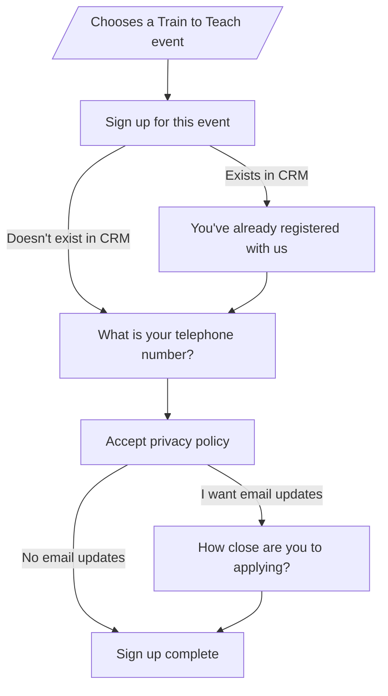

## Event signup flow

```mermaid
graph TD;
  chooses_event[/Chooses a Train to Teach event/] --> sign_up_for_this_event
  sign_up_for_this_event[Sign up for this event] -- Doesn't exist in CRM --> telephone_number[What is your telephone number?] --> accept_privacy_policy[Accept privacy policy]

  sign_up_for_this_event -- Exists in CRM --> already_registered[You've already registered with us]
  already_registered --> telephone_number

  accept_privacy_policy -- I want email updates --> how_close_are_you_to_applying[How close are you to applying?]
  accept_privacy_policy -- No email updates --> complete[Sign up complete]

  how_close_are_you_to_applying --> complete

```
