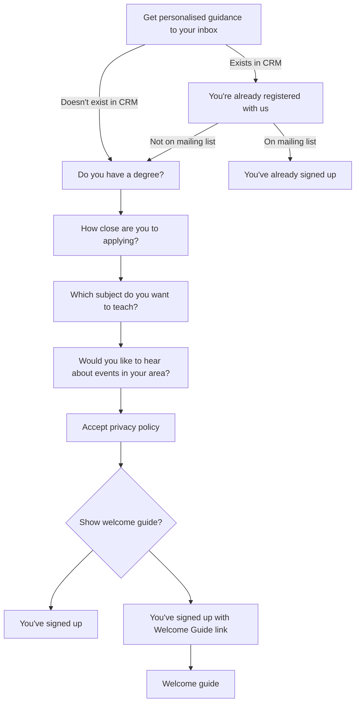

# Mailing list signup flow

## Show welcome guide logic

In order to display the welcome guide to a candidate they must:

* be a final year student
* be a graduate who in the 'how close are you to applying' question answered:
  * It’s just an idea
  * I’m not sure and finding out more
