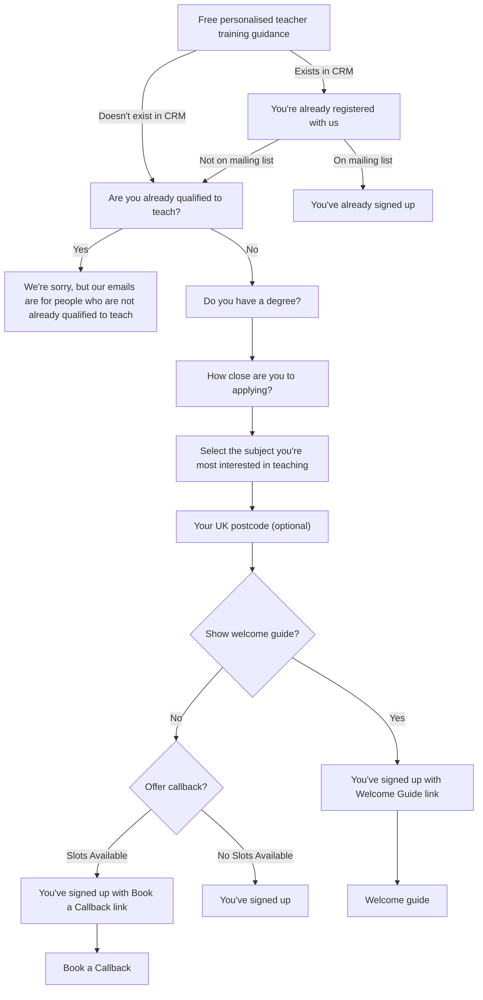
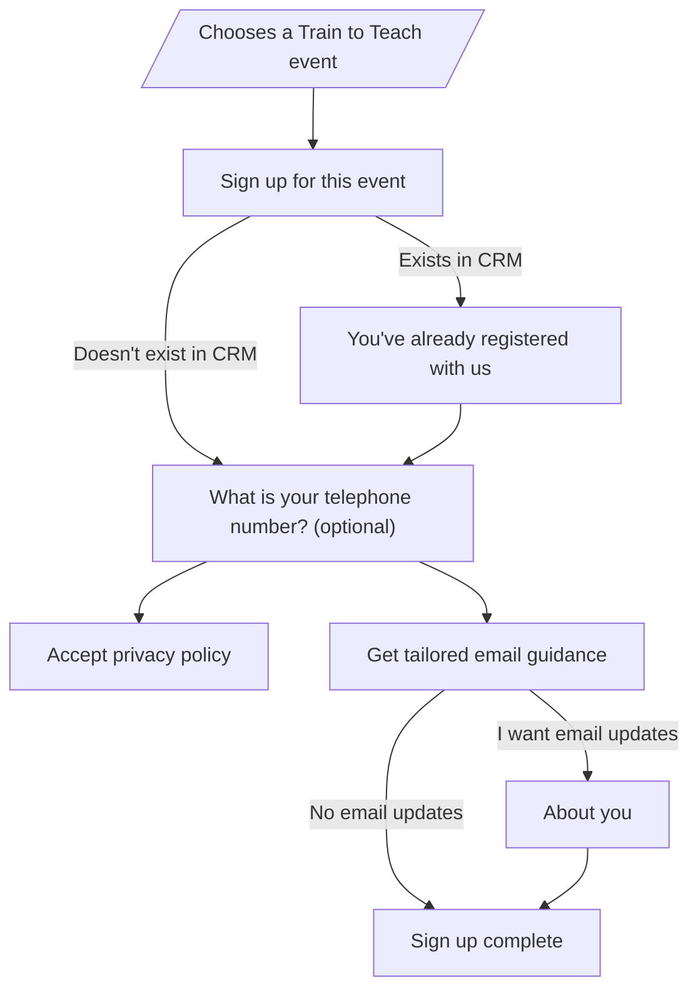
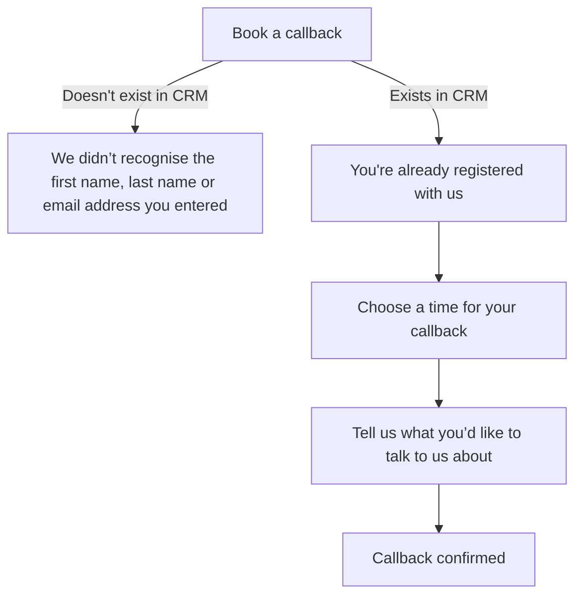

# Sign up journeys

There are multiple different sign up journeys available on the Get into Teaching website. The logic for what the user sees during the sign up is captured in the graphs below (you can view them on [mermaid.live](https://mermaid.live/)).

## Mailing list sign up flow

### Show welcome guide logic

In order to display the welcome guide to a candidate they must:

* be a final year student
* be a graduate who in the 'how close are you to applying' question answered:
  * It’s just an idea
  * I’m not sure and finding out more

## Event sign up flow

## Book a callback flow

## Adviser sign up flow

The adviser sign up is complex and has multiple branches, making it difficult to model in graph TD. We maintain a [lucid board](https://lucid.app/lucidchart/dd4d9f2d-57e9-406c-b58b-bb3847460142/edit?from_internal=true) with screenshots of the different journeys instead.
